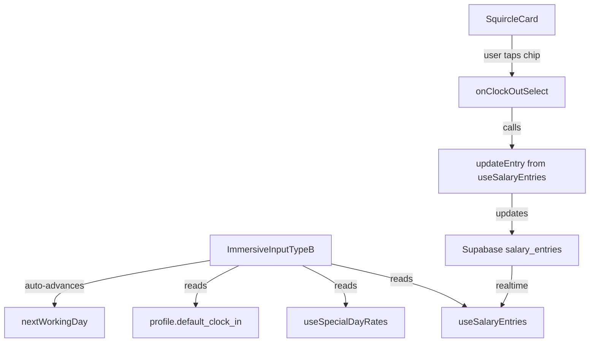

# Design Document: Type B Immersive Input

## Overview

The Type B Immersive Input feature introduces an alternative, simplified salary entry interface specifically designed for Type B employees (shift_type: 'overtime'). Unlike the existing table-based interface, this immersive view presents working days sequentially in large, rounded square cards (squircles), allowing users to input clock-out times one day at a time with minimal cognitive load.

### Design Goals

1. **Simplicity**: Reduce cognitive load by showing one day at a time in focus
2. **Accessibility**: Large touch targets and clear typography for older, less tech-savvy users
3. **Efficiency**: Quick time entry via tappable chips instead of keyboard input
4. **Error Recovery**: Easy correction of previous day's entry without leaving the flow
5. **Mobile-First**: Optimized for mobile devices (320px-428px viewport width)

### Target Users

Type B employees are typically older restaurant workers who:
- Have limited technical proficiency
- Prefer simple, focused interfaces over complex tables
- Work on mobile devices
- Need to enter clock-out times daily (clock-in is fixed)

## Architecture

### Component Hierarchy

```
EmployeeSalaryEntry (page)
├── SalaryTableTypeB (existing table view)
└── ImmersiveInputTypeB (new component) ← NEW
    ├── SquircleCard (day card component) ← NEW
    │   ├── DateDisplay
    │   ├── ClockInDisplay (read-only)
    │   ├── ClockOutChipGrid ← NEW
    │   └── CalculationSummary
    └── ViewToggle (switch between table/immersive) ← NEW
```

### State Management

The immersive view will leverage existing hooks and state management:

- **useSalaryEntries**: Existing hook for CRUD operations on salary_entries
- **useSpecialDayRates**: Existing hook for rate lookups
- **useEmployeeAllowances**: Existing hook for allowance management
- **useSalaryRecord**: Existing hook for draft saving

New local state in ImmersiveInputTypeB:
- `currentDayIndex`: Index of the day currently in focus
- `isTransitioning`: Boolean to prevent input during animations
- `editingPreviousDay`: Boolean to track if user is correcting previous entry
- `viewMode`: 'table' | 'immersive' (persisted in sessionStorage)

### Data Flow



## Components and Interfaces

### ImmersiveInputTypeB Component

**Purpose**: Main container for the immersive sequential input experience

**Props**:
```typescript
interface ImmersiveInputTypeBProps {
  entries: SalaryEntry[];
  rates: SpecialDayRate[];
  allowances: EmployeeAllowance[];
  baseSalary: number;
  hourlyRate: number;
  globalClockIn: string;
  periodStart: string;
  periodEnd: string;
  onEntryUpdate: (entryDate: string, sortOrder: number, updates: Partial<SalaryEntry>) => void;
  breakdown: SalaryBreakdown | null;
  currentUserId: string;
}
```

**State**:
```typescript
interface ImmersiveState {
  currentDayIndex: number;
  isTransitioning: boolean;
  editingPreviousDay: boolean;
  workingDays: SalaryEntry[]; // filtered to exclude is_day_off
}
```

**Key Methods**:
- `getWorkingDays()`: Filter entries to only working days (is_day_off === false)
- `handleChipSelect(time: string)`: Update clock_out and advance to next day
- `handlePreviousDayEdit()`: Enable editing of previous day
- `advanceToNextDay()`: Increment currentDayIndex with animation
- `calculateDailySummary(entry: SalaryEntry)`: Compute daily wage for display

### SquircleCard Component

**Purpose**: Display a single working day in a large, rounded card format

**Props**:
```typescript
interface SquircleCardProps {
  entry: SalaryEntry;
  rate: number;
  globalClockIn: string;
  dailyBase: number;
  hourlyRate: number;
  state: 'focus' | 'review';
  onClockOutSelect: (time: string) => void;
  onEdit?: () => void;
  isTransitioning: boolean;
}
```

**Visual States**:
- **Focus State**: Large card (bottom half), interactive chips, prominent date
- **Review State**: Smaller card (top half), read-only display, tap to edit

**Layout**:
```
┌─────────────────────────────┐
│  [Date] [Weekday]           │
│  Giờ vào: 17:00 (read-only) │
│                             │
│  ┌───┐ ┌───┐ ┌───┐         │
│  │17.5│ │18.0│ │18.5│       │ ← Clock-out chips
│  └───┘ └───┘ └───┘         │
│  ┌───┐ ┌───┐ ┌───┐         │
│  │19.0│ │19.5│ │20.0│       │
│  └───┘ └───┘ └───┘         │
│                             │
│  Lương: 150k  PC: 30k       │ ← Summary
└─────────────────────────────┘
```

### ClockOutChipGrid Component

**Purpose**: Display tappable time options in a grid layout

**Props**:
```typescript
interface ClockOutChipGridProps {
  baseTime: string; // globalClockIn
  selectedTime: string | null;
  onSelect: (time: string) => void;
  disabled: boolean;
}
```

**Chip Generation Logic**:
```typescript
function generateChipTimes(baseTime: string): string[] {
  const [hours, minutes] = baseTime.split(':').map(Number);
  const baseMinutes = hours * 60 + minutes;
  
  // Generate 30-minute increments from +0.5h to +5h
  const offsets = [30, 60, 90, 120, 150, 180, 210, 240, 270, 300];
  
  return offsets.map(offset => {
    const totalMinutes = baseMinutes + offset;
    const h = Math.floor(totalMinutes / 60);
    const m = totalMinutes % 60;
    return `${h.toString().padStart(2, '0')}:${m.toString().padStart(2, '0')}`;
  });
}
```

**Display Format**: Decimal hours (e.g., "17.5" instead of "17:30") for simplicity

### ViewToggle Component

**Purpose**: Switch between table view and immersive view

**Props**:
```typescript
interface ViewToggleProps {
  currentView: 'table' | 'immersive';
  onToggle: (view: 'table' | 'immersive') => void;
}
```

**Persistence**: Store preference in sessionStorage as `typeB_viewMode`

## Data Models

### Existing Models (No Changes)

The feature uses existing data models from `src/types/salary.ts`:

- **SalaryEntry**: Represents a single day's entry
- **SpecialDayRate**: Rate multipliers for special days
- **EmployeeAllowance**: Additional allowances
- **SalaryBreakdown**: Computed salary breakdown

### Derived Data Structures

**WorkingDay** (computed, not stored):
```typescript
interface WorkingDay {
  entry: SalaryEntry;
  rate: number;
  dailyWage: number;
  allowanceAmount: number;
  extraWage: number;
  totalWage: number;
}
```

Computed from SalaryEntry + rates using existing `computeTotalSalaryTypeB` logic.

## Error Handling

### Data Loading Errors

**Scenario**: Failed to load salary entries or profile data

**Handling**:
1. Display error message in place of squircle cards
2. Show retry button
3. Log error to console for debugging
4. Fallback to table view if immersive view fails

**UI**:
```tsx
<div className="glass-card p-8 text-center space-y-4">
  <p className="text-destructive">Không thể tải dữ liệu chấm công</p>
  <button onClick={retry} className="btn-primary">Thử lại</button>
  <button onClick={() => setViewMode('table')} className="btn-secondary">
    Chuyển sang bảng
  </button>
</div>
```

### Save Errors

**Scenario**: Failed to update clock_out time in database

**Handling**:
1. Show toast notification with error message
2. Revert UI to previous state
3. Do not advance to next day
4. Allow user to retry

**Implementation**:
```typescript
const handleChipSelect = async (time: string) => {
  const previousClockOut = currentEntry.clock_out;
  
  try {
    // Optimistic update
    setIsTransitioning(true);
    await onEntryUpdate(currentEntry.entry_date, currentEntry.sort_order, {
      clock_out: time
    });
    
    // Success: advance to next day
    setTimeout(() => advanceToNextDay(), 300);
  } catch (error) {
    // Revert on error
    toast.error('Lỗi lưu giờ ra. Vui lòng thử lại.');
    setIsTransitioning(false);
    // UI will show previous state due to realtime sync
  }
};
```

### Edge Cases

**No Working Days**:
- Display message: "Không có ngày làm việc trong kỳ này"
- Show button to return to main salary view

**All Days Completed**:
- Display completion message with checkmark icon
- Show total salary summary
- Provide button to view full breakdown or return to main view

**Period Not Active**:
- Disable immersive view
- Show message: "Kỳ lương đã kết thúc"
- Redirect to published salary view

## Testing Strategy

### Why Property-Based Testing Does NOT Apply

This feature is **UI-heavy with complex interaction patterns and animations**. Property-based testing is not appropriate because:

1. **UI Rendering**: Testing visual layout, card positioning, and responsive design requires snapshot tests or visual regression tests
2. **Animation Behavior**: Slide transitions, easing functions, and timing are best tested with integration tests or manual QA
3. **Touch Interactions**: Tap targets, gesture handling, and mobile-specific behavior require device testing
4. **Accessibility**: WCAG compliance, focus management, and screen reader compatibility need manual testing with assistive technologies

### Testing Approach

#### Unit Tests

**Component Rendering**:
- SquircleCard renders correctly with focus/review states
- ClockOutChipGrid generates correct time options
- ViewToggle switches between modes correctly

**Data Filtering**:
- `getWorkingDays()` correctly filters out off-days
- `generateChipTimes()` produces valid time strings
- `calculateDailySummary()` matches existing Type B calculation logic

**Example Tests**:
```typescript
describe('ImmersiveInputTypeB', () => {
  it('filters out off-days from entries', () => {
    const entries = [
      { entry_date: '2025-01-01', is_day_off: false, ... },
      { entry_date: '2025-01-02', is_day_off: true, ... },
      { entry_date: '2025-01-03', is_day_off: false, ... },
    ];
    const workingDays = getWorkingDays(entries);
    expect(workingDays).toHaveLength(2);
    expect(workingDays[0].entry_date).toBe('2025-01-01');
    expect(workingDays[1].entry_date).toBe('2025-01-03');
  });

  it('generates chip times in 30-minute increments', () => {
    const chips = generateChipTimes('17:00');
    expect(chips).toEqual([
      '17:30', '18:00', '18:30', '19:00', '19:30',
      '20:00', '20:30', '21:00', '21:30', '22:00'
    ]);
  });
});
```

#### Integration Tests

**User Flow**:
1. Load immersive view with working days
2. Select clock-out chip for current day
3. Verify entry updates in database
4. Verify UI advances to next day
5. Tap previous day card to edit
6. Verify edit mode activates
7. Complete all days and verify completion state

**Error Scenarios**:
1. Simulate save failure and verify error handling
2. Test with empty working days list
3. Test with single working day
4. Test with all days already completed

#### Manual Testing

**Mobile Devices**:
- Test on iOS Safari (iPhone 12, 13, 14)
- Test on Android Chrome (various screen sizes)
- Verify touch targets are at least 44x44 CSS pixels
- Test landscape orientation

**Accessibility**:
- Keyboard navigation through chips
- Screen reader announcements for state changes
- Color contrast meets WCAG AA (4.5:1)
- Focus indicators are visible

**Animation Performance**:
- Verify 60fps during transitions on mid-range devices
- Test with reduced motion preference enabled
- Verify no layout shifts during animations

#### Snapshot Tests

**Visual Regression**:
- Capture snapshots of SquircleCard in focus state
- Capture snapshots of SquircleCard in review state
- Capture snapshots of completion screen
- Capture snapshots of error states

### Test Coverage Goals

- **Unit Tests**: 80% coverage of business logic functions
- **Integration Tests**: Cover all critical user paths
- **Manual Tests**: Test on at least 3 different mobile devices
- **Accessibility**: WCAG AA compliance verified manually

### Testing Tools

- **Vitest**: Unit and integration tests
- **React Testing Library**: Component testing
- **Playwright**: E2E tests for user flows
- **axe-core**: Automated accessibility checks (supplemented with manual testing)

## Implementation Plan

### Phase 1: Core Components (Week 1)

1. Create `ImmersiveInputTypeB.tsx` component skeleton
2. Implement `SquircleCard.tsx` with static layout
3. Implement `ClockOutChipGrid.tsx` with chip generation
4. Add basic styling with Tailwind CSS

### Phase 2: Interaction Logic (Week 1-2)

1. Implement chip selection handler
2. Add state management for current day index
3. Integrate with `useSalaryEntries` hook
4. Implement working day filtering logic

### Phase 3: Animations (Week 2)

1. Add Framer Motion for slide transitions
2. Implement focus → review state animation
3. Add next day slide-in animation
4. Implement previous day edit mode

### Phase 4: View Toggle (Week 2)

1. Create `ViewToggle.tsx` component
2. Add toggle to `EmployeeSalaryEntry.tsx`
3. Implement sessionStorage persistence
4. Add conditional rendering logic

### Phase 5: Polish & Testing (Week 3)

1. Add error handling and edge cases
2. Implement completion screen
3. Write unit and integration tests
4. Conduct mobile device testing
5. Accessibility audit and fixes

### Phase 6: Documentation & Deployment (Week 3)

1. Update user documentation
2. Create demo video for training
3. Deploy to staging for user acceptance testing
4. Gather feedback and iterate
5. Deploy to production

## Technical Decisions

### Animation Library: Framer Motion

**Rationale**: Already used in the codebase (see `SalaryTableTypeB.tsx`), provides declarative animations, excellent performance on mobile.

**Alternative Considered**: React Spring (more complex API, steeper learning curve)

### State Management: React Hooks

**Rationale**: Leverage existing hooks (`useSalaryEntries`, etc.), no need for additional state management library for this feature.

**Alternative Considered**: Zustand (unnecessary complexity for localized state)

### Styling: Tailwind CSS

**Rationale**: Consistent with existing codebase, rapid prototyping, excellent mobile-first utilities.

**Alternative Considered**: CSS Modules (less flexible, more boilerplate)

### Time Display Format: Decimal Hours

**Rationale**: Simpler for users to understand (17.5 vs 17:30), reduces cognitive load, matches existing table view format.

**Alternative Considered**: HH:MM format (more familiar but requires more mental math)

### Persistence: sessionStorage

**Rationale**: View preference should persist within session but reset on new session (allows users to try immersive view without permanent commitment).

**Alternative Considered**: localStorage (too persistent, may confuse users who want to switch back)

## Accessibility Considerations

### Touch Targets

- All chips: minimum 44x44 CSS pixels
- Squircle cards: minimum 48px height for tap area
- Spacing between chips: minimum 8px

### Typography

- Date display: 24px (1.5rem) font size
- Clock-in display: 18px (1.125rem) font size
- Chip labels: 16px (1rem) font size
- Body text: 16px (1rem) minimum

### Color Contrast

- Primary text on background: 7:1 (AAA)
- Secondary text on background: 4.5:1 (AA)
- Chip borders: 3:1 (AA for UI components)
- Selected chip: 4.5:1 (AA)

### Keyboard Navigation

- Tab order: Previous day card → Current day chips (left to right, top to bottom) → View toggle
- Enter/Space: Activate chip selection
- Escape: Cancel previous day edit mode

### Screen Reader Support

- Announce current day when focus state changes
- Announce selected time when chip is tapped
- Announce completion when all days are done
- Label all interactive elements with aria-label

### Reduced Motion

Respect `prefers-reduced-motion` media query:
```css
@media (prefers-reduced-motion: reduce) {
  .squircle-transition {
    transition-duration: 0.01ms !important;
  }
}
```

## Performance Considerations

### Animation Performance

- Use `transform` and `opacity` for animations (GPU-accelerated)
- Avoid animating `height`, `width`, or `top/left` (causes reflow)
- Use `will-change` sparingly and only during transitions
- Target 60fps on mid-range devices (iPhone 11, Samsung Galaxy A52)

### Rendering Optimization

- Memoize `workingDays` computation with `useMemo`
- Memoize `calculateDailySummary` with `useMemo`
- Use `React.memo` for `SquircleCard` to prevent unnecessary re-renders
- Debounce rapid chip taps during transition

### Data Loading

- Leverage existing realtime subscriptions (no additional queries)
- Filter working days client-side (small dataset, no performance impact)
- Preload next day's data during transition animation

### Bundle Size

- Framer Motion already in bundle (no additional cost)
- New components: estimated ~5KB gzipped
- Total impact: negligible (<1% increase)

## Security Considerations

### Data Access

- Reuse existing RLS policies (no changes needed)
- Users can only view/edit their own salary entries
- Admin-reviewed entries cannot be deleted by employees

### Input Validation

- Clock-out times validated against reasonable ranges (globalClockIn + 0.5h to +5h)
- Date validation: entries must be within current period
- Prevent duplicate submissions during transition animations

### XSS Prevention

- All user input (notes, times) sanitized by Supabase
- No `dangerouslySetInnerHTML` used
- React's built-in XSS protection sufficient

## Deployment Strategy

### Feature Flag

Implement feature flag to enable/disable immersive view:
```typescript
const ENABLE_IMMERSIVE_VIEW = import.meta.env.VITE_ENABLE_IMMERSIVE_VIEW === 'true';
```

### Rollout Plan

1. **Week 1**: Deploy to staging, internal testing
2. **Week 2**: Enable for 10% of Type B employees (A/B test)
3. **Week 3**: Gather feedback, iterate on UX
4. **Week 4**: Enable for 50% of Type B employees
5. **Week 5**: Full rollout to all Type B employees

### Rollback Plan

If critical issues arise:
1. Disable feature flag via environment variable
2. Users automatically fall back to table view
3. No data loss (all entries saved to same database tables)

### Monitoring

Track metrics:
- Adoption rate (% of Type B users using immersive view)
- Completion rate (% of users completing all days)
- Error rate (failed saves, crashes)
- Time to complete (compare immersive vs table)
- User feedback (in-app survey after first use)

## Future Enhancements

### Phase 2 Features (Post-MVP)

1. **Swipe Gestures**: Swipe up to advance, swipe down to go back
2. **Bulk Edit**: Edit multiple days at once
3. **Voice Input**: "Giờ ra mười chín giờ" → 19:00
4. **Offline Support**: Queue updates when offline, sync when online
5. **Customizable Chip Ranges**: Let users configure time increments
6. **Dark Mode Optimization**: Enhanced contrast for night shift workers

### Integration with Other Features

1. **Notifications**: Remind users to complete daily entry
2. **Analytics**: Show trends (average hours, busiest days)
3. **Export**: Download immersive view entries as PDF
4. **Admin Dashboard**: View completion rates across all Type B employees

## Appendix

### Design Mockups

(Mockups would be created in Figma and linked here)

### User Research Findings

(Summary of interviews with Type B employees about current pain points)

### Competitive Analysis

(Review of similar time-tracking apps with sequential input flows)

### Glossary

- **Squircle**: Rounded square shape (border-radius: 24px or higher)
- **Focus State**: The active, interactive card where user input is expected
- **Review State**: The previous day's card shown for reference and correction
- **Chip**: A tappable button representing a time option
- **Working Day**: A day where is_day_off is false
- **Type B Employee**: Employee with shift_type 'overtime'
